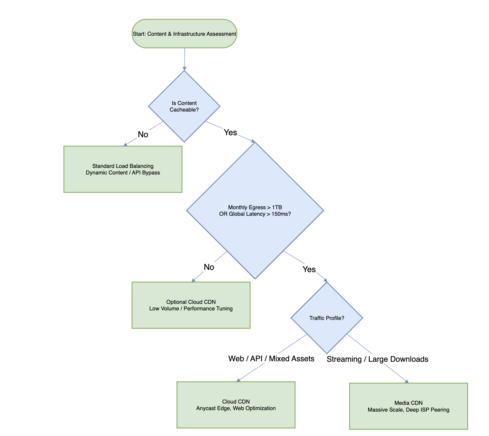
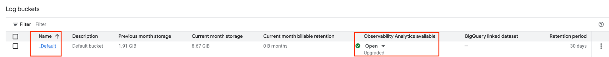
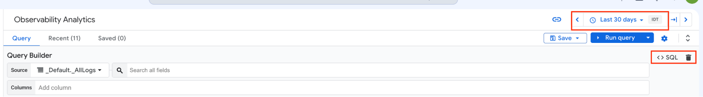
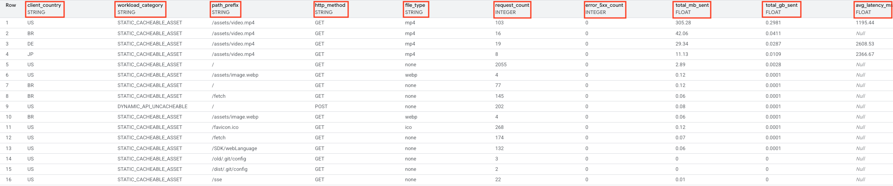
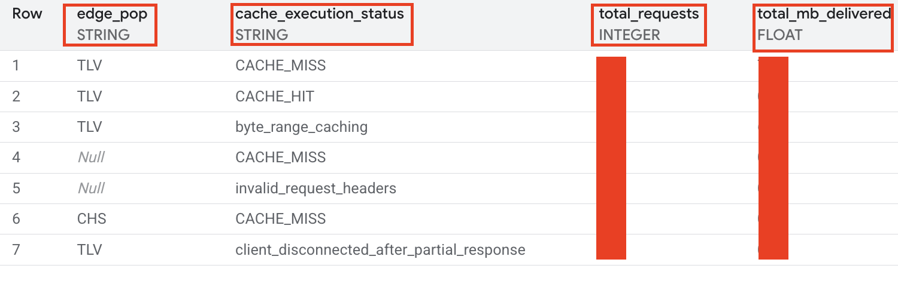

GCP CDN Decision Framework: Assessing Needs and Defining CDN type

Visibility: Public

Target Platform: Medium.com

Category: Infrastructure Strategy & Edge Architecture

Author: Fredy Maizlev

# Expert Capsule: The One-Pager

## Technical Abstract

This guide is designed to help answer two critical questions for your Google Cloud architecture: Do I need a Content Delivery Network (CDN)? And if so, which one is right for me (Cloud CDN vs. Media CDN)?As your application grows, relying on a single centralized server can lead to slow load times for global users, high bandwidth bills, and an increased risk of your site crashing during traffic spikes. A CDN solves these problems by storing (caching) your content on servers located right next to your users around the world. This approach dramatically lowers your network costs, protects your backend servers from being overwhelmed, and ensures a faster, more secure experience for your customers.

## CDN Value

1. Egress Cost Optimization: Offloading static asset delivery to the network edge structurally lowers egress expenditures. By serving content directly from edge PoPs rather than the centralized origin, architectures capitalize on lower CDN egress rates compared to standard internet Data Transfer Out (DTO) and leverage discounted cache-fill operations to minimize inter-region transit fees.

2. Cacheability Profiling & Performance: Utilizing GCP Anycast IP architecture and ISP peering reduces the Round Trip Time (RTT) for global users. Granular caching strategies separate static media from dynamic mutations.

3. Scalability and Origin Protection: Edge caching prevents "Origin Collapse" during high-concurrency events by aggregating concurrent misses and serving the vast majority of traffic directly from the cache.

4. Integrated Edge Security: Native integration with Google Cloud Armor allows organizations to deploy web application firewalls (WAF) and DDoS protection at the edge, securing the cache bandwidth and backend origins.

---

# Deep Dive: The Technical Decision Framework

## Part 1: Do I Need a CDN?

The architectural decision to implement a Content Delivery Network (CDN) is driven by three primary operational triggers: the volume and cost of data transfer, the geographic distribution of the user base, and backend resource constraints.

### The 1–2 TB Monthly Egress Cost Cliff

For architectures serving static assets (e.g., media files, compiled JavaScript, cascading stylesheets, firmware binaries), the 1–2 TB monthly outbound threshold represents a financial pivot point. Standard internet egress pricing from cloud providers incurs higher operational expenditure compared to the discounted cache-fill rates applied when a CDN retrieves content from Google Cloud Storage (GCS), Compute Engine, or serverless infrastructure. Once volume eclipses this threshold, the CDN effectively amortizes its own cost through heavily reduced egress billing.

### Global Audience Latency Patterns

Distance creates delay. When 95% of your global users are waiting longer than 150–200ms just to load static files, adding a CDN becomes a necessity. Instead of forcing users to make a long round-trip to your main server just to establish a connection, CDNs handle the TCP and TLS security handshakes locally at the edge. This significantly speeds up load times and improves the user experience.

### Backend Origin Collapse Mechanics

Without an edge caching tier, every individual client request executes against the backend origin. During high-concurrency events—such as software releases, flash sales, or viral marketing—the resulting "thundering herd" effect can rapidly exhaust origin socket connections, memory buffers, or compute cycles, resulting in HTTP 502/503 timeouts and total service degradation. CDNs operate as a resilient buffer, absorbing these traffic spikes.

### Cacheability Test Matrix

|  |  |  |
| --- | --- | --- |
| Asset Type | Cacheability | Strategic Edge Treatment |
| Static Media (Images, Video) | High | Cache aggressively at the edge; leverage long TTLs (e.g., 1 year). |
| Web Assets (JS, CSS, Fonts) | High | Cache utilizing versioned filenames (cache busting) to ensure freshness. |
| API Responses (Public/Generic) | Medium | Implement short TTL caching (seconds to minutes) via s-maxage. |
| Personal/Private Data | None | Bypass CDN entirely; route strictly to the backend origin. |
| State Mutations (POST/PUT/DELETE) | None | Proxy securely through the edge load balancer; do not invoke cache lookups. |

## Part 2: Which CDN is Right for Me?

Google Cloud provides two distinct CDN architectures tailored to specific traffic profiles and object delivery requirements.

### Cloud CDN

* Infrastructure: ~180+ global Anycast edge Points of Presence (PoPs).
* Ideal Use Case: Web applications, API payload acceleration, and general-purpose site speed.
* Strengths: Seamless integration with the External Application Load Balancer, native Google Cloud Armor security policies, and broad support for modern web standards.

### Media CDN

* Infrastructure: ~3,000+ Google Global Cache (GGC) nodes embedded deeply within Tier-1 and Tier-2 ISP networks (leveraging the YouTube delivery backbone).
* Ideal Use Case: High-throughput streaming, massive game client downloads, and large-scale software updates.
* Strengths: Delivers maximum throughput for large objects (up to 1 TiB) by placing content physically inside the end-user's local ISP network, minimizing transit hops and native edge protection via Google Cloud Armor edge security policies

### Advanced Edge Capabilities

* Origin Shielding via Request Collapsing (Both CDNs): Both Cloud CDN and Media CDN are designed to shield your backend servers from traffic spikes. If thousands of users request a file that isn't cached yet, both products automatically merge (coalesce) those concurrent requests together at the edge. The CDN sends exactly one fetch to your backend origin, heavily insulating your servers from overload during cache misses.

* Dedicated Origin Shield Tier (Media CDN): Because Media CDN operates across a massive footprint of 3,000+ embedded ISP nodes, it adds an extra architectural layer of protection. It uses a dedicated, intermediate caching tier between the edge nodes and your origin server. This aggregates requests from multiple global regions before they ever reach your backend, providing a necessary secondary shield for massive video or game client downloads.

* Dynamic Compression (Brotli & Gzip): Minimizes payload size and improves Time-to-First-Byte (TTFB) by automatically compressing cacheable text responses (JSON, CSS, HTML) directly at the edge, optimizing bandwidth without taxing origin CPU.

* Edge Extensibility (Wasm / gRPC): Media CDN and Cloud CDN both support WebAssembly (Wasm) Service Extensions for executing lightweight logic at the edge (e.g., header manipulation, JWT validation). Furthermore, Cloud CDN supports external gRPC callouts for advanced request routing and synchronous authorization workflows.

* Private Bucket Origin Authentication: Securing external or multi-cloud backend origins requires explicit authentication. Cloud CDN leverages Internet Network Endpoint Groups (NEGs) paired with HMAC cryptographic keys to seamlessly authenticate requests to private external object storage (e.g., Amazon S3), ensuring the origin remains isolated from the public internet.

## Visual Decision Architecture



## GitHub README / CDN Self-Assessment Guide

## Repository Structure

```text
. 
├── monitoring/ 
│   ├── log_analytics_queries.sql    # Egress and latency tracking 
│   └── dashboard_filters.txt        # Cloud Logging filters 
├── terraform/ 
│   ├── main.tf                      # CDN and Origin resources 
│   ├── variables.tf                 # Project-specific variables 
│   └── outputs.tf                   # Target IPs and bucket names 
└── docs/    
    └── troubleshooting_matrix.md    # Cache header reference
```

## Log Analytics: Tracking the Egress Cliff and User Experience

Before deploying  CDN, we need hard data to prove your architecture has crossed the cost and performance thresholds. The most accurate way to do this is by analyzing the existing Global Load Balancer logs to see exactly how much static data is sent to the end users (the "Egress Cliff") and how much latency they are experiencing.

Fortunately, you don't need to build a complex data pipeline to get these answers. We can use Log Analytics, a feature that executes natively inside Cloud Logging using the BigQuery engine under the hood. This allows you to run high-performance SQL queries directly against your logs to evaluate your traffic, all without having to provision a standalone BigQuery workspace.

Here is how to run the self-assessment:

### Step 1: Ensure the Log Bucket is Upgraded to Log Analytics

If you haven't already upgraded your \_Default bucket, you need to do this first:

* In the Google Cloud Console, use the left-hand navigation menu to go to Logging > Log Storage.
* Locate the \_Default bucket.
* If it is not upgraded, click Upgrade to enable Log Analytics.



### Step 2: Run the Egress Analysis Query

To run this query, navigate to the new Observability Analytics interface and use the SQL editor:

* In the Google Cloud Console, use the left-hand navigation menu to go to Logging > Observability Analytics (formerly Log Analytics).
* Set the Time Frame: In the top right corner, set the time range filter to 30 Days (or at least 7 days). Because Google Cloud egress billing and the 1–2 TB baseline threshold are evaluated on a monthly cycle,  30-day lookback window offers the most accurate representation of regular usage patterns.
* By default, you may be in the Query Builder (visual mode). Click the SQL button or toggle to switch to the SQL text editor.



Paste the following query into the editor:

```sql
SELECT
  REGEXP_EXTRACT(http_request.request_url, r'https?://[^/]+(/[^?#]*)') AS path_prefix,
  CASE
    WHEN http_request.status >= 500 THEN 'ORIGIN_COLLAPSE_5XX'
    WHEN http_request.request_method IN ('POST', 'PUT', 'DELETE', 'PATCH')
         OR http_request.request_url LIKE '%/api/%'
         OR http_request.request_url LIKE '%/graphql%' THEN 'DYNAMIC_API_UNCACHEABLE'
    ELSE 'STATIC_CACHEABLE_ASSET'
  END AS workload_category,
  http_request.request_method AS http_method,
  COALESCE(LOWER(REGEXP_EXTRACT(http_request.request_url, r'\.([a-zA-Z0-9]+)(?:[\?#]|$)')), 'none') AS file_type,
  COUNT(*) AS request_count,
  COUNTIF(http_request.status >= 500) AS error_5xx_count,
  ROUND(SUM(http_request.response_size) / 1024 / 1024, 2) AS total_mb_sent,
  ROUND(SUM(http_request.response_size) / 1024 / 1024 / 1024, 4) AS total_gb_sent,
  ROUND(AVG(http_request.latency.seconds * 1000 + http_request.latency.nanos / 1000000.0), 2) AS avg_latency_ms,
  STRING_AGG(DISTINCT COALESCE(
    JSON_VALUE(json_payload.clientLocation),
    JSON_VALUE(json_payload.client_location),
    JSON_VALUE(json_payload.securityPolicyRequestData.clientCountry),
    http_request.remote_ip
  ), ', ') AS destination_countries_or_ips
FROM
  `YOUR_PROJECT_ID.global._Default._AllLogs`
WHERE
  resource.type = "http_load_balancer"
GROUP BY
  1, 2, 3, 4
ORDER BY
  error_5xx_count DESC,
  total_mb_sent DESC;
```

> **[📁 View Raw SQL File: `monitoring/egress_analysis.sql`](./monitoring/egress_analysis.sql)**

Expected Output:



### Data Interpretation Matrix

|  |  |  |  |
| --- | --- | --- | --- |
| Metric | Move to CDN Indicator / Threshold | Do NOT Move / Bypass Indicator | Architectural Decision & Action |
| path\_prefix | Static Paths:  /assets/\*, /static/\*, /./images/\*, /downloads/\* | Dynamic Endpoints:  /api/\*, /auth/\*, /graphql/\*, /checkout/\* | If Static Path: Cache at edge.  If Dynamic Path: Configure URL map route rules to bypass CDN caching directly to compute backends. |
| workload\_category | STATIC\_CACHEABLE\_ASSET or ORIGIN\_COLLAPSE\_5XX | DYNAMIC\_API\_UNCACHEABLE | STATIC: Prime candidate for Cloud/Media CDN.  COLLAPSE: Protect origin via CDN Request Collapsing.  DYNAMIC: Route directly to origin to prevent 0% CHR overhead. |
| http\_method | Safe Methods:  GET, HEAD | State-Changing Methods:  POST, PUT, PATCH, DELETE | GET/HEAD: Eligible for edge cache storage.  POST/PUT: Uncacheable; proxy through Google edge but bypass cache lookups. |
| file\_type | Cacheable Extensions:  mp4, webp, zip, js, css, png, dmg, exe | Non-Static / Dynamic:  none, json, html (personalized/dynamic) | If Static: Cache with appropriate edge TTLs.  If None/Dynamic: Pass directly to backend services. |
| request\_count | High Concurrency:  > 100,000 requests/month | Low Volume:  < 10,000 requests/month | High + Static: Edge caching offloads CPU and TCP/TLS handshakes from origin instances. |
| error\_5xx\_count | Origin Overload:  ORIGIN\_COLLAPSE\_5XX> 0 (backend timeouts/failures) | Healthy Origin:  0 errors | If > 0: Deploy CDN with Request Collapsing and Origin Shield to aggregate concurrent misses into 1 origin fetch. |
| total\_mb\_sent | High MB on individual file paths (e.g., video assets) | Sub-megabyte or negligible traffic | Pinpoints exact high-bandwidth asset paths responsible for backend network transfer. |
| total\_gb\_sent | Above Egress Cliff:  > 1,000–2,000 GB (1–2 TB) | Below Egress Cliff:  < 1,000 GB (< 1 TB) | > 1–2 TB + Static: Immediate ROI through reduced CDN egress pricing and $0.00 GCS cache fill.  < 1 TB: Retain standard origin. |
| avg\_latency\_ms | High Latency:  > 150–200 ms | Low Latency:  < 50 ms (clients local to backend region) | > 150 ms + Global: Deploy Cloud CDN to terminate TLS at 180+ Anycast PoPs close to users. Note that load balancer latency metrics include origin processing time; high latency can be a symptom of an overloaded backend rather than solely a network issue requiring a CDN. |
| destination\_countries\_or\_ips | Global Footprint:  Multiple international country codes (US, IL, BR, DE) | Single Local Region:  Single country code matching backend region | Multi-Country: Justifies edge delivery.  Single Local Region: Standard origin delivery is sufficient without CDN. |

## 

Step 3:Run backend Origin Collapse Diagnostic query (Log Explorer Filter)

If the SQL query in the previous step reveals a high number of 5xx errors, you must verify whether those errors are caused by bad application code, or actual infrastructure exhaustion.

This Log Explorer query is designed to detect active infrastructure exhaustion. While standard HTTP 500 errors can often be caused by application bugs or bad code deployments, this specific filter isolates capacity-driven failures at the load balancer level, proving that your backend is being overwhelmed and needs a CDN.

```text
resource.type="http_load_balancer"
httpRequest.status>=500
(jsonPayload.statusDetails="backend_timeout" OR jsonPayload.statusDetails="backend_connection_closed_before_data_sent_to_client")
```

> **[📁 View Raw Filter: `monitoring/dashboard_filters.txt`](./monitoring/dashboard_filters.txt)**

**Note on Prerequisites:**

* **Cloud CDN:** Requires standard `roles/compute.networkAdmin` and `roles/storage.admin` IAM permissions.
* **Media CDN:** Access requires explicit project allowlisting via the Google Cloud sales/account team. Self-service registration is not natively available in the console.

## Deployment via Official Terraform Blueprints

For CDN deployment , use Google Cloud's official Terraform architectures:

* For Cloud CDN: Use [terraform-google-lb-http](https://www.google.com/url?q=https://github.com/terraform-google-modules/terraform-google-lb-http&sa=D&source=editors&ust=1789391605442458&usg=AOvVaw3LxgABZFmf7BzrsPE8Y1Sy) with backends.default.enable\_cdn = true.
* For Serverless origins (Cloud Run/Functions): See Set up Cloud CDN with Serverless NEGs.
* For Media CDN: Use [terraform-google-media-cdn-vod](https://www.google.com/url?q=https://github.com/GoogleCloudPlatform/terraform-google-media-cdn-vod&sa=D&source=editors&ust=1789391605442790&usg=AOvVaw12b9KOZPbXfFPsN2nOyGd1)

When defining backend policies in Terraform, add diagnostic headers to monitor edge execution:

```hcl
custom_response_headers = [
  "X-Cache-Status: {cdn_cache_status}",
  "X-Cache-ID: {cdn_cache_id}",
  "X-Client-Geo: {client_region},{client_city}"
]
```

> **[📁 View Terraform Config: `terraform/main.tf`](./terraform/main.tf)**

## Edge Verification & Operational Runbook

Once the load balancer is provisioned, you can use these independent operational tools to validate edge caching, debug cache fragmentation, and trigger rapid invalidations.

### Edge Hit / Miss Validation

Send continuous requests using curl to evaluate state transitions across cache instances.

```bash
# Export the target domain or Load Balancer Anycast IP
export TARGET_URL="http://YOUR_LOAD_BALANCER_IP/assets/app.js"

# 1. First probe: Cold origin fetch (Cache Fill)
curl -s -D - -o /dev/null "${TARGET_URL}" | grep -Ei "(HTTP/|via|age|x-cache|cache-control)"
```

> **[📁 View Script: `scripts/test_cache_hit.sh`](./scripts/test_cache_hit.sh)**

Expected Cold Output:

```http
HTTP/1.1 200 OK
x-goog-metageneration: 1
x-goog-storage-class: STANDARD
Cache-Control: public,max-age=3600
X-Cache-Status: miss
X-Cache-ID: TLV
```

```bash
# 2. Second probe: Immediate re-request (Edge Hit)
curl -s -D - -o /dev/null "${TARGET_URL}" | grep -Ei "(HTTP/|via|age|x-cache|cache-control)"
```

Expected Warm Output:

```http
HTTP/1.1 200 OK
x-goog-metageneration: 1
x-goog-storage-class: STANDARD
Age: 156 (the elapsed time in seconds since the content was pulled from the origin)
Cache-Control: public,max-age=3600
X-Cache-Status: hit (CDN status)
X-Cache-ID: TLV (CDN location)
```

### Decouple Edge vs. Browser TTLs (CDN-Cache-Control)

By configuring your origin to send RFC 9213 targeted headers, you can instruct the Google edge network to cache content for a full 24 hours while simultaneously forcing users' web browsers to check for updates every minute

```http
Cache-Control: public, max-age=60
CDN-Cache-Control: public, max-age=86400
```

* Client Browser: Refetches or revalidates every 60 seconds.
* Cloud CDN: Serves cached hits from the edge for up to 86,400 seconds (1 day), shielding the backend origin from repeated traffic.

### Cache Invalidation (Emergency Purge)

When emergency patches require purging stale assets prior to TTL expiration, submit invalidation requests across Google's edge fleet.

```bash
# Invalidate a single file globally (~10 second propagation)
gcloud compute url-maps invalidate-cdn-cache URL_MAP_NAME \
    --path "/assets/app.js" \
    --async

# Invalidate an entire directory prefix
gcloud compute url-maps invalidate-cdn-cache URL_MAP_NAME \
    --path "/assets/*"

# Invalidate scoped strictly to a specific staging or prod hostname
gcloud compute url-maps invalidate-cdn-cache URL_MAP_NAME \
    --host "app.example.com" \
    --path "/static/*"
```

> **[📁 View Script: `scripts/invalidate_cache.sh`](./scripts/invalidate_cache.sh)**

Expected output:

Completed invalidation for [https://www.googleapis.com/compute/v1/projects/xxxx/global/urlMaps/xxxxx].

### Logging > Observability Analytics (formerly Log Analytics).

Run this query inside Cloud Logging > Log Analytics to monitor real-time Cache Hit Ratios (CHR) and isolate origin-bound traffic

To run this query, navigate to the new Observability Analytics interface and use the SQL editor:

* In the Google Cloud Console, use the left-hand navigation menu to go to Logging > Observability Analytics (formerly Log Analytics).
* Set the Time Frame: In the top right corner, set the time range filter to 1 Hour. This ensures the UI time picker matches the real-time monitoring window defined in the SQL query below.
* By default, you may be in the Query Builder (visual mode). Click the SQL button or toggle to switch to the SQL text editor.


```sql
SELECT
   JSON_VALUE(json_payload.cacheId) AS edge_pop, 
  CASE
     
    WHEN JSON_VALUE(json_payload.statusDetails) = 'response_from_cache' THEN 'CACHE_HIT'  
    WHEN JSON_VALUE(json_payload.statusDetails) = 'response_from_cache_validated' THEN 'CACHE_REVALIDATED'  
    WHEN JSON_VALUE(json_payload.statusDetails) = 'response_sent_by_backend' THEN 'CACHE_MISS'  
    ELSE JSON_VALUE(json_payload.statusDetails) 
  END AS cache_execution_status,  COUNT(*) AS total_requests,  ROUND(SUM(http_request.response_size) / 1024 / 1024, 2) AS total_mb_delivered
FROM
   `YOUR_PROJECT_ID.global._Default._AllLogs`
WHERE
   resource.type = "http_load_balancer"  AND timestamp >= TIMESTAMP_SUB(CURRENT_TIMESTAMP(), INTERVAL 1 HOUR)
GROUP BY
   1, 2
ORDER BY
   total_requests DESC;
```

> **[📁 View Raw SQL File: `monitoring/cache_execution_analysis.sql`](./monitoring/cache_execution_analysis.sql)**

Expected Output:



### Data Interpretation Matrix

|  |  |  |  |
| --- | --- | --- | --- |
| Metric | Healthy Edge Indicator / Threshold | Warning / Inefficient Cache Indicator | Operational Decision & Action |
| edge\_pop | \*\*Global Distribution:\*\*Multiple IATA airport codes (e.g., LHR, IAD, TLV) representing diverse edge nodes. | \*\*High Null Count:\*\*A large volume of Null locations alongside valid traffic. | If valid codes: Confirms Anycast routing is successfully distributing users to their nearest edge location.If Null: Indicates requests are bypassing the CDN cache layer entirely or being blocked by Google Front End (e.g., invalid\_request\_headers). |
| cache\_execution\_status | \*\*High Cache Hit Ratio:\*\*CACHE\_HIT or CACHE\_REVALIDATED dominate the results. | \*\*Origin Overload:\*\*CACHE\_MISS represents the majority of requests. | If HIT: The edge is successfully shielding the backend origin from repeated traffic.If MISS: Investigate low TTL configurations, or check if you are accidentally causing cache key fragmentation by varying on headers like User-Agent. |
| total\_requests | \*\*Traffic Offload:\*\*High request volume maps almost entirely to CACHE\_HIT. | \*\*Thundering Herd:\*\*High concurrency maps to CACHE\_MISS during a launch or traffic spike. | Action: Use this column to calculate your overall Cache Hit Ratios (CHR). If CHR is low for static assets, you must tune your CDN-Cache-Control headers to increase edge TTLs. |
| total\_mb\_delivered | \*\*Cost Savings:\*\*Massive MB/GB volume is aligned with CACHE\_HIT. | \*\*Egress Cost Warning:\*\*High MB/GB volume is aligned with CACHE\_MISS. | Action: High MB on a CACHE\_MISS means the edge network required an upstream origin fill, which incurs backend egress costs. Increase edge caching durations for heavy assets (like video or software binaries) to immediately lower cloud billing. |

### Diagnostic Header Reference

|  |  |  |
| --- | --- | --- |
| Header | Example / Directives | Operational Meaning |
| X-Cache-Status | HIT, MISS, REVALIDATED | Evaluates whether the Google edge served the object directly or required an upstream origin fill. |
| X-Cache-ID | LHR-85e2bd4b | Pinpoints the exact IATA airport code (e.g., London Heathrow) and internal cache partition serving the request. |
| Via | 1.1 google | Confirms the request was proxied and inspected by Google Front End (GFE) edge proxies. |
| Age | 3600 | Indicates elapsed time in seconds since the asset was cached at the edge. |
| Vary | Accept-Encoding | Informs caches to store separate versions (e.g., gzip vs. brotli). Avoid varying on headers like User-Agent to prevent cache key fragmentation. |